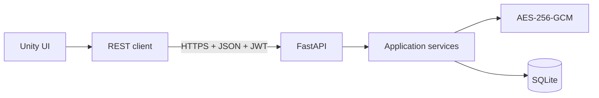

# Otter Password Manager

A password manager built with a Unity client and a FastAPI backend. It provides
JWT authentication, encrypted vault entries, SQLite persistence, and a simple
Unity user interface.

[Polska wersja](pl_readme.md)

## Technology stack

- Unity client in C# using `UnityWebRequest` and async/await
- Python 3.13 and FastAPI
- SQLAlchemy 2 and SQLite
- Alembic migrations
- Argon2 account-password hashing
- JWT access and refresh tokens
- AES-256-GCM vault encryption

## Architecture



## Quick start

```powershell
cd backend
.\.venv\Scripts\alembic.exe upgrade head
.\.venv\Scripts\python.exe -m otter_password_manager
```

Open `Assets/Scenes/SampleScene.unity` and press **Play**. Swagger UI is available
at `http://127.0.0.1:8000/docs`.

## Documentation

- [English documentation](docs/en/README.md)
- [Polska dokumentacja](docs/pl/README.md)

## Security status

This project is under active development. Before exposing it publicly, review the
[security checklist](docs/en/security.md), protect or remove `/api/v1/users`, add
refresh-token rotation, and deploy exclusively behind HTTPS.
