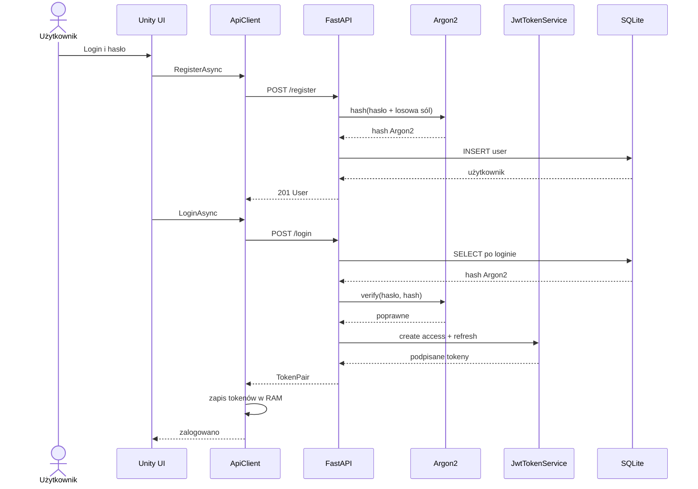

# REST API

Bazowy adres lokalny: `http://127.0.0.1:8000`. Wszystkie dane wejściowe i
wyjściowe używają JSON, poza odpowiedzią `204 No Content`.

## Autoryzacja

Chronione endpointy wymagają nagłówka:

```http
Authorization: Bearer <access_token>
```

Refresh token nie jest access tokenem i middleware go odrzuci. Obecnie nie ma
endpointu `/refresh`; po wygaśnięciu access tokenu klient musi zalogować się ponownie.

## Zestawienie endpointów

| Metoda | Ścieżka | Dostęp | Opis |
|---|---|---|---|
| POST | `/register` | publiczny | Rejestracja |
| POST | `/login` | publiczny | Logowanie i wydanie tokenów |
| GET | `/passwords` | access JWT | Lista własnych wpisów |
| GET | `/passwords/{id}` | access JWT | Jeden własny wpis |
| POST | `/passwords` | access JWT | Utworzenie wpisu |
| PUT | `/passwords/{id}` | access JWT | Pełna aktualizacja wpisu |
| DELETE | `/passwords/{id}` | access JWT | Usunięcie wpisu |
| POST | `/api/v1/users` | access JWT | Techniczne utworzenie użytkownika |
| GET | `/api/v1/users` | access JWT | Techniczna lista użytkowników |
| GET | `/api/v1/users/{id}` | access JWT | Techniczny odczyt użytkownika |
| PATCH | `/api/v1/users/{id}` | access JWT | Techniczna aktualizacja użytkownika |
| DELETE | `/api/v1/users/{id}` | access JWT | Techniczne usunięcie użytkownika |

> Endpointy `/api/v1/users` nie mają autoryzacji opartej na rolach. Każdy
> uwierzytelniony użytkownik może je obecnie wywołać. Należy je wyłączyć albo dodać
> rolę administratora przed wdrożeniem publicznym.

## POST /register

Login ma 3–100 znaków i dopuszcza litery, cyfry, `_`, `-`, `.`. Hasło ma co
najmniej 12 i maksymalnie 128 znaków.

```bash
curl -X POST http://127.0.0.1:8000/register \
  -H "Content-Type: application/json" \
  -d '{"login":"otter","password":"bezpieczne-haslo-123"}'
```

Odpowiedź `201 Created`:

```json
{
  "id": 1,
  "login": "otter",
  "created_at": "2026-07-18T12:00:00Z"
}
```

Możliwe błędy: `409` zajęty login, `422` niepoprawne dane.

## POST /login

```bash
curl -X POST http://127.0.0.1:8000/login \
  -H "Content-Type: application/json" \
  -d '{"login":"otter","password":"bezpieczne-haslo-123"}'
```

Odpowiedź `200 OK`:

```json
{
  "access_token": "eyJ...",
  "refresh_token": "eyJ...",
  "token_type": "bearer"
}
```

Błędny login i błędne hasło zwracają ten sam `401`, aby nie ujawniać istnienia konta.

## Model wpisu hasła

Payload zapisu:

```json
{
  "service_name": "Example",
  "username": "otter@example.com",
  "password": "tajne-haslo",
  "website": "https://example.com",
  "notes": "Konto prywatne"
}
```

`website` i `notes` mogą być `null`. API nigdy nie przyjmuje `owner_id`; właściciel
pochodzi z JWT.

Odpowiedź:

```json
{
  "id": 10,
  "service_name": "Example",
  "username": "otter@example.com",
  "password": "tajne-haslo",
  "website": "https://example.com",
  "notes": "Konto prywatne",
  "created_at": "2026-07-18T12:00:00Z",
  "updated_at": "2026-07-18T12:00:00Z"
}
```

Hasło w odpowiedzi jest jawne, dlatego produkcja musi bezwzględnie używać HTTPS.

## GET /passwords

```bash
curl http://127.0.0.1:8000/passwords \
  -H "Authorization: Bearer $ACCESS_TOKEN"
```

Zwraca `200` i tablicę wyłącznie wpisów właściciela tokenu.

## GET /passwords/{id}

```bash
curl http://127.0.0.1:8000/passwords/10 \
  -H "Authorization: Bearer $ACCESS_TOKEN"
```

Zwraca `404`, jeżeli wpis nie istnieje **lub należy do innego użytkownika**. Takie
zachowanie ogranicza możliwość sprawdzania cudzych identyfikatorów.

## POST /passwords

```bash
curl -X POST http://127.0.0.1:8000/passwords \
  -H "Authorization: Bearer $ACCESS_TOKEN" \
  -H "Content-Type: application/json" \
  -d '{"service_name":"Example","username":"otter","password":"secret","website":null,"notes":null}'
```

Zwraca `201 Created` i utworzony wpis.

## PUT /passwords/{id}

PUT wymaga pełnego payloadu, również pola `password`:

```bash
curl -X PUT http://127.0.0.1:8000/passwords/10 \
  -H "Authorization: Bearer $ACCESS_TOKEN" \
  -H "Content-Type: application/json" \
  -d '{"service_name":"Example 2","username":"new-login","password":"new-secret","website":"https://example.com","notes":null}'
```

Zwraca `200` albo `404`. Hasło zostaje ponownie zaszyfrowane z nowym nonce.

## DELETE /passwords/{id}

```bash
curl -X DELETE http://127.0.0.1:8000/passwords/10 \
  -H "Authorization: Bearer $ACCESS_TOKEN"
```

Zwraca `204 No Content` albo `404`.

## Kody błędów

| Kod | Znaczenie |
|---|---|
| 401 | brak, błędny lub wygasły token; błędne dane logowania |
| 404 | zasób nie istnieje albo nie należy do użytkownika |
| 409 | konflikt unikalnego loginu |
| 422 | walidacja requestu nie powiodła się |
| 500 | nieobsłużony błąd serwera; sprawdź logi |

FastAPI publikuje zawsze aktualny kontrakt w `/docs` i `/openapi.json`; ma on
pierwszeństwo przed przykładami, jeśli implementacja zostanie później zmieniona.

## Scenariusz rejestracji i logowania



