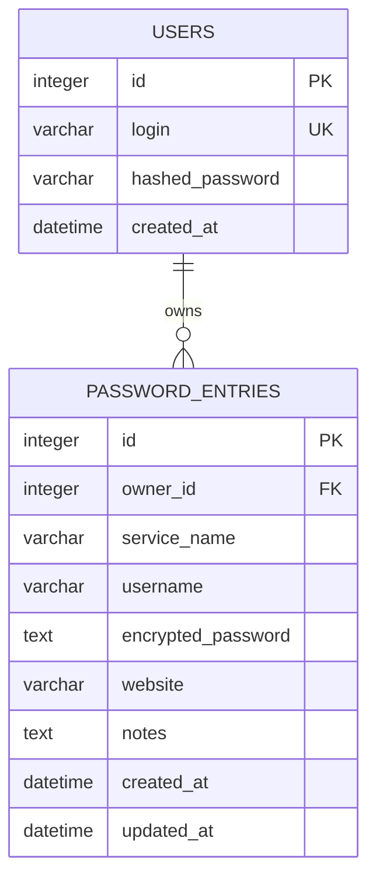

# SQLite i dane

## Lokalizacja

Domyślna baza:

```text
backend/data/otter_password_manager.db
```

Ścieżkę ustawia `OTTER_DATABASE_URL`. Pliki `-wal` i `-shm`, jeśli się pojawią,
są częścią aktywnego stanu SQLite i trzeba uwzględnić je przy niekontrolowanym
kopiowaniu działającej bazy.

## Schemat



`owner_id` wskazuje `users.id`. `ON DELETE CASCADE` usuwa wpisy po usunięciu
użytkownika. Aplikacja włącza `PRAGMA foreign_keys=ON` dla połączeń SQLite.

`encrypted_password` ma format wersjonowanej koperty AES-GCM. Klucz nie znajduje
się w tabeli ani w innym rekordzie bazy.

## Trwałość

Zatrzymanie Uvicorna lub restart VPS nie usuwa danych. Dane znikają tylko po
usunięciu/utracie pliku, wykonaniu destrukcyjnej migracji albo operacji DELETE.

## Bezpieczna kopia zapasowa

Najprostsza metoda dla małej instalacji — krótka przerwa:

```bash
sudo systemctl stop otter-password-manager
sudo install -d -m 700 /var/backups/otter-password-manager
sudo cp /opt/otter-password-manager/backend/data/otter_password_manager.db \
  /var/backups/otter-password-manager/otter-$(date +%F-%H%M%S).db
sudo systemctl start otter-password-manager
```

Kopia online przez narzędzie SQLite używa spójnego mechanizmu backupu:

```bash
sqlite3 /opt/otter-password-manager/backend/data/otter_password_manager.db \
  ".backup '/var/backups/otter-password-manager/otter-latest.db'"
```

Nie kopiuj tylko głównego pliku podczas aktywnego zapisu bez użycia `.backup` lub
zatrzymania usługi.

## Co musi obejmować backup

Do odzyskania systemu potrzebne są dwa niezależne elementy:

1. spójna kopia pliku SQLite,
2. bezpieczna kopia `OTTER_ENCRYPTION_KEY`.

Bez bazy nie ma rekordów. Bez właściwego klucza zaszyfrowane hasła są praktycznie
nieodzyskiwalne. Kopię klucza trzymaj oddzielnie od kopii bazy, np. w menedżerze
sekretów lub zaszyfrowanym sejfie offline.

## Odtwarzanie

```bash
sudo systemctl stop otter-password-manager
sudo cp /var/backups/otter-password-manager/otter-latest.db \
  /opt/otter-password-manager/backend/data/otter_password_manager.db
sudo chown otter:otter /opt/otter-password-manager/backend/data/otter_password_manager.db
sudo systemctl start otter-password-manager
```

Po odtworzeniu uruchom `alembic current` i ewentualnie `alembic upgrade head`.
Przetestuj logowanie oraz odszyfrowanie przykładowego wpisu.

## Kontrola i diagnostyka

```bash
sqlite3 data/otter_password_manager.db "PRAGMA integrity_check;"
sqlite3 data/otter_password_manager.db ".tables"
sqlite3 data/otter_password_manager.db "PRAGMA foreign_key_check;"
```

Nie wyświetlaj `encrypted_password` w logach. Mimo szyfrowania kopie bazy traktuj
jak dane poufne.

## Ograniczenia SQLite

SQLite jest dobrym wyborem dla pojedynczego VPS i małego ruchu. Używaj jednego
procesu Uvicorn i trwałego dysku. Przy wielu instancjach serwera, dużej liczbie
równoczesnych zapisów lub wysokiej dostępności rozważ PostgreSQL.

## Migracje Alembic

Aktualizacja:

```powershell
cd backend
.\.venv\Scripts\alembic.exe upgrade head
.\.venv\Scripts\alembic.exe current
```

Nowa migracja po zmianie modeli:

```powershell
.\.venv\Scripts\alembic.exe revision --autogenerate -m "opis zmiany"
```

Przed zatwierdzeniem zawsze przeczytaj wygenerowane `upgrade()` i `downgrade()`.
Modele muszą być importowane w `infrastructure/database/models/__init__.py`, aby
Alembic widział je w metadanych.

Na produkcji kolejność wdrożenia:

1. wykonaj backup,
2. zatrzymaj usługę, jeśli migracja zmienia istniejące dane,
3. wgraj kod,
4. uruchom `alembic upgrade head`,
5. uruchom usługę i test zdrowia/logowania.

