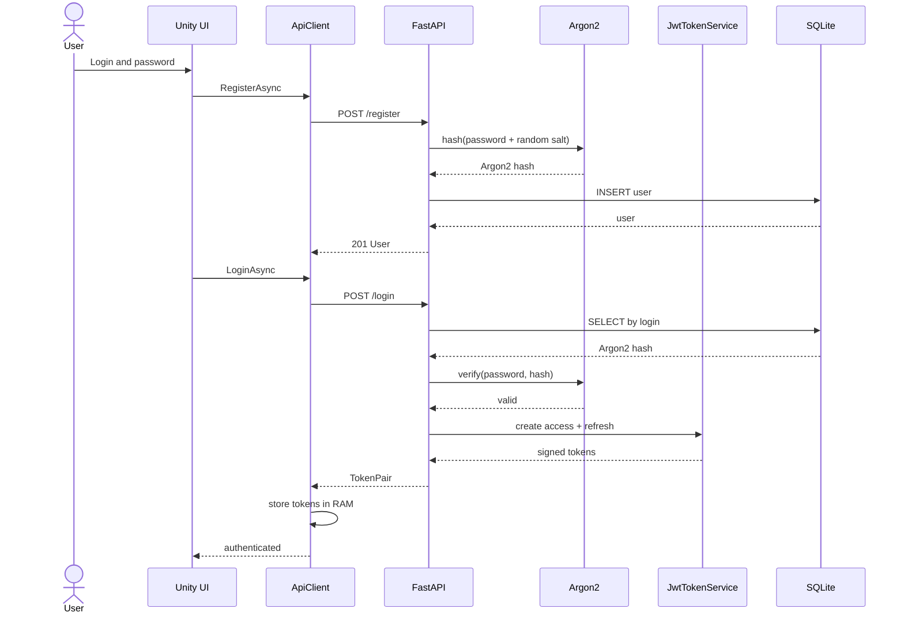

# REST API

[Polska wersja](../pl/api.md)

Local base URL: `http://127.0.0.1:8000`. Requests and responses use JSON, except
for `204 No Content` responses.

## Authorization

Protected endpoints require:

```http
Authorization: Bearer <access_token>
```

A refresh token is not an access token and is rejected by the middleware. There is
currently no `/refresh` endpoint, so clients must log in again after expiration.

## Endpoint summary

| Method | Path | Access | Description |
|---|---|---|---|
| POST | `/register` | Public | Register a user |
| POST | `/login` | Public | Log in and issue tokens |
| GET | `/passwords` | Access JWT | List owned entries |
| GET | `/passwords/{id}` | Access JWT | Read an owned entry |
| POST | `/passwords` | Access JWT | Create an entry |
| PUT | `/passwords/{id}` | Access JWT | Fully update an entry |
| DELETE | `/passwords/{id}` | Access JWT | Delete an entry |
| POST | `/api/v1/users` | Access JWT | Technical user creation |
| GET | `/api/v1/users` | Access JWT | Technical user list |
| GET | `/api/v1/users/{id}` | Access JWT | Technical user lookup |
| PATCH | `/api/v1/users/{id}` | Access JWT | Technical user update |
| DELETE | `/api/v1/users/{id}` | Access JWT | Technical user deletion |

> `/api/v1/users` does not enforce roles. Any authenticated user can currently
> call these endpoints. Disable them or add administrator authorization before a
> public deployment.

## POST /register

The login must contain 3–100 characters and may use letters, digits, `_`, `-`, and
`.`. The password must contain 12–128 characters.

```bash
curl -X POST http://127.0.0.1:8000/register \
  -H "Content-Type: application/json" \
  -d '{"login":"otter","password":"a-secure-password-123"}'
```

`201 Created`:

```json
{
  "id": 1,
  "login": "otter",
  "created_at": "2026-07-18T12:00:00Z"
}
```

Possible errors: `409` for a duplicate login and `422` for invalid input.

## POST /login

```bash
curl -X POST http://127.0.0.1:8000/login \
  -H "Content-Type: application/json" \
  -d '{"login":"otter","password":"a-secure-password-123"}'
```

`200 OK`:

```json
{
  "access_token": "eyJ...",
  "refresh_token": "eyJ...",
  "token_type": "bearer"
}
```

Invalid login and password attempts return the same `401` response to avoid
revealing whether an account exists.

## Password entry model

Write payload:

```json
{
  "service_name": "Example",
  "username": "otter@example.com",
  "password": "secret-password",
  "website": "https://example.com",
  "notes": "Personal account"
}
```

`website` and `notes` may be `null`. The API never accepts `owner_id`; ownership
comes from the JWT.

Response:

```json
{
  "id": 10,
  "service_name": "Example",
  "username": "otter@example.com",
  "password": "secret-password",
  "website": "https://example.com",
  "notes": "Personal account",
  "created_at": "2026-07-18T12:00:00Z",
  "updated_at": "2026-07-18T12:00:00Z"
}
```

The response contains the plaintext vault password, so production must use HTTPS.

## GET /passwords

```bash
curl http://127.0.0.1:8000/passwords \
  -H "Authorization: Bearer $ACCESS_TOKEN"
```

Returns `200` and an array containing only the token owner's entries.

## GET /passwords/{id}

```bash
curl http://127.0.0.1:8000/passwords/10 \
  -H "Authorization: Bearer $ACCESS_TOKEN"
```

Returns `404` when the entry does not exist **or belongs to another user**. This
prevents clients from enumerating foreign identifiers.

## POST /passwords

```bash
curl -X POST http://127.0.0.1:8000/passwords \
  -H "Authorization: Bearer $ACCESS_TOKEN" \
  -H "Content-Type: application/json" \
  -d '{"service_name":"Example","username":"otter","password":"secret","website":null,"notes":null}'
```

Returns `201 Created` and the created entry.

## PUT /passwords/{id}

PUT requires the full payload, including `password`:

```bash
curl -X PUT http://127.0.0.1:8000/passwords/10 \
  -H "Authorization: Bearer $ACCESS_TOKEN" \
  -H "Content-Type: application/json" \
  -d '{"service_name":"Example 2","username":"new-login","password":"new-secret","website":"https://example.com","notes":null}'
```

Returns `200` or `404`. The password is re-encrypted with a fresh nonce.

## DELETE /passwords/{id}

```bash
curl -X DELETE http://127.0.0.1:8000/passwords/10 \
  -H "Authorization: Bearer $ACCESS_TOKEN"
```

Returns `204 No Content` or `404`.

## Error codes

| Code | Meaning |
|---|---|
| 401 | missing, invalid, or expired token; invalid login credentials |
| 404 | resource does not exist or is not owned by the caller |
| 409 | duplicate login conflict |
| 422 | request validation failed |
| 500 | unhandled server error; inspect server logs |

FastAPI publishes the current contract at `/docs` and `/openapi.json`. That
contract takes precedence over these examples if the implementation changes.

## Registration and login scenario



