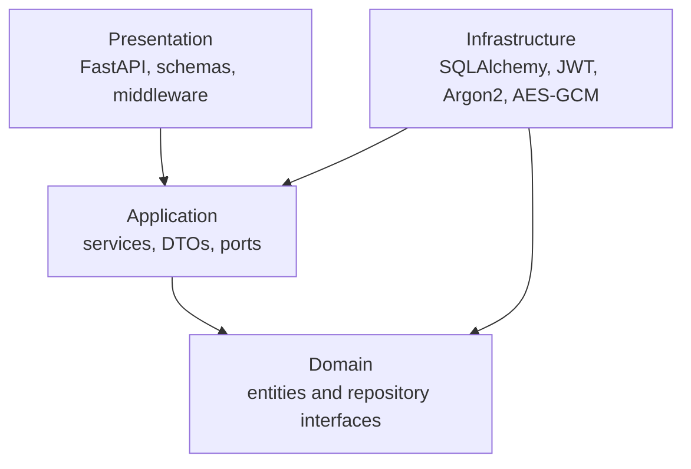
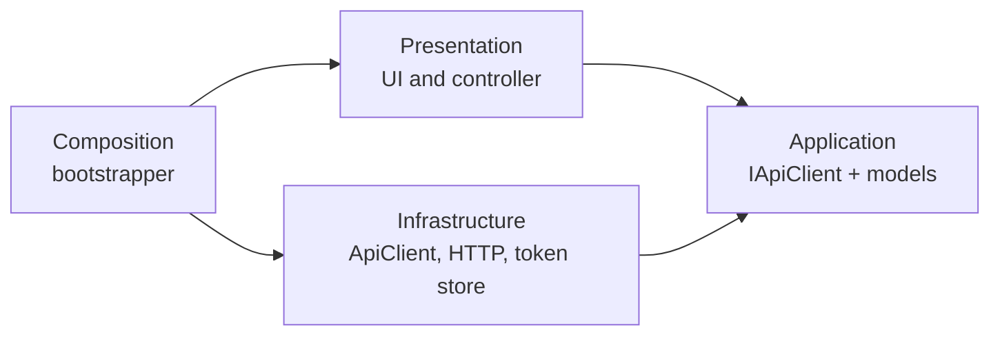
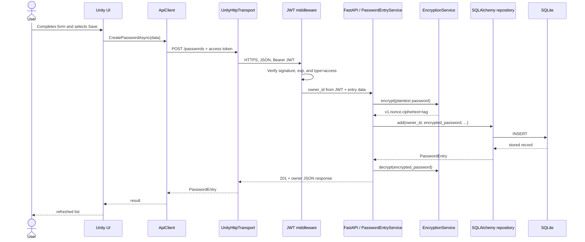

# Solution architecture

[Polska wersja](../pl/architecture.md)

## System view

```mermaid
flowchart LR
    U[User] --> UI[Unity UI<br/>PasswordManagerController]
    UI --> AC[IApiClient / ApiClient]
    AC --> HT[UnityHttpTransport]
    HT -->|HTTPS + JSON + Bearer JWT| RP[Reverse proxy<br/>Caddy or Nginx]
    RP --> API[FastAPI / Uvicorn]
    API --> MW[JWT middleware]
    MW --> UC[Application services]
    UC --> ENC[EncryptionService<br/>AES-256-GCM]
    UC --> REP[SQLAlchemy repositories]
    REP --> DB[(SQLite)]
    API --> JWT[JwtTokenService]
    API --> ARGON[Argon2PasswordHasher]
    ENC -. key from .env .-> ENV[VPS secrets]
    JWT -. secret from .env .-> ENV
```

Unity and the backend run as separate processes. Unity never accesses SQLite or
Python code directly. The REST API is the only communication boundary.

## Backend — Clean Architecture



Dependency rule: inner layers do not depend on external frameworks.

### Domain

- `User` — vault owner.
- `PasswordEntry` — an entry containing an encrypted password.
- `UserRepository` and `PasswordEntryRepository` — persistence contracts.

### Application

- `UserService` — user CRUD and registration rules.
- `AuthenticationService` — credential verification and token issuance.
- `PasswordEntryService` — vault CRUD, ownership rules, and encryption orchestration.
- `UnitOfWork`, `PasswordHasher`, `TokenService`, and `EncryptionPort` ports.
- DTOs independent of FastAPI and SQLAlchemy.

### Infrastructure

- SQLAlchemy models and repositories,
- `SqlAlchemyUnitOfWork`,
- `Argon2PasswordHasher`,
- `JwtTokenService`,
- `EncryptionService`,
- configuration, database sessions, and logging.

### Presentation

- FastAPI routers,
- Pydantic schemas,
- JWT middleware,
- dependency providers and exception-to-HTTP mapping.

### Composition root

`ApplicationContainer` builds the database engine, session factory, port
implementations, and services. `main.py` composes FastAPI and manages resource
lifetime.

## Unity responsibilities



- `PasswordManagerController` builds views and handles user events.
- `IApiClient` is the UI-facing contract.
- `ApiClient` maps application operations to endpoints.
- `UnityHttpTransport` handles only HTTP and JSON.
- `ITokenStore` abstracts token storage.
- `ApplicationBootstrapper` constructs and connects the object graph.

## Scenario: saving a password



The plaintext password exists briefly in client memory, the HTTPS request, and
backend memory. SQLite stores only the AES-GCM envelope.

