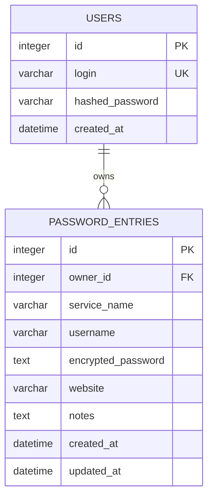

# SQLite and data management

[Polska wersja](../pl/database.md)

## Location

Default database file:

```text
backend/data/otter_password_manager.db
```

`OTTER_DATABASE_URL` controls the path. SQLite `-wal` and `-shm` files, when
present, are part of the active state and matter when copying a live database.

## Schema



`owner_id` references `users.id`. `ON DELETE CASCADE` removes entries when their
owner is deleted. The application enables `PRAGMA foreign_keys=ON` for SQLite
connections. `encrypted_password` contains an AES-GCM envelope; its key is not in
the database.

## Persistence

Stopping Uvicorn or restarting the VPS does not remove data. Data is lost only
through file loss, destructive migrations, or DELETE operations.

## Safe backups

The simplest method for a small installation uses a short maintenance window:

```bash
sudo systemctl stop otter-password-manager
sudo install -d -m 700 /var/backups/otter-password-manager
sudo cp /opt/otter-password-manager/backend/data/otter_password_manager.db \
  /var/backups/otter-password-manager/otter-$(date +%F-%H%M%S).db
sudo systemctl start otter-password-manager
```

Online backup with the SQLite backup API:

```bash
sqlite3 /opt/otter-password-manager/backend/data/otter_password_manager.db \
  ".backup '/var/backups/otter-password-manager/otter-latest.db'"
```

Do not copy only the main file during active writes without using `.backup` or
stopping the service.

## Required backup components

Full recovery requires:

1. a consistent SQLite backup,
2. a secure copy of `OTTER_ENCRYPTION_KEY`.

Without the database there are no records. Without the original key, vault
passwords are effectively unrecoverable. Keep the key backup separate from the
database backup, such as in a secrets manager or encrypted offline vault.

## Restoring

```bash
sudo systemctl stop otter-password-manager
sudo cp /var/backups/otter-password-manager/otter-latest.db \
  /opt/otter-password-manager/backend/data/otter_password_manager.db
sudo chown otter:otter /opt/otter-password-manager/backend/data/otter_password_manager.db
sudo systemctl start otter-password-manager
```

Run `alembic current`, then `alembic upgrade head` if necessary. Test login and
decryption of a known entry.

## Integrity checks

```bash
sqlite3 data/otter_password_manager.db "PRAGMA integrity_check;"
sqlite3 data/otter_password_manager.db ".tables"
sqlite3 data/otter_password_manager.db "PRAGMA foreign_key_check;"
```

Treat database backups as sensitive even though entry passwords are encrypted.

## SQLite limits

SQLite is suitable for a single VPS and modest traffic. Use one Uvicorn process and
persistent storage. Consider PostgreSQL for multiple server instances, high write
concurrency, or high-availability requirements.

## Alembic migrations

```powershell
cd backend
.\.venv\Scripts\alembic.exe upgrade head
.\.venv\Scripts\alembic.exe current
.\.venv\Scripts\alembic.exe revision --autogenerate -m "change description"
```

Always review generated `upgrade()` and `downgrade()` functions. Every model must
be imported from `infrastructure/database/models/__init__.py` for Alembic metadata
discovery.

Production migration order:

1. create a backup,
2. stop the service when existing data is being transformed,
3. deploy code,
4. run `alembic upgrade head`,
5. start the service and perform a smoke test.

