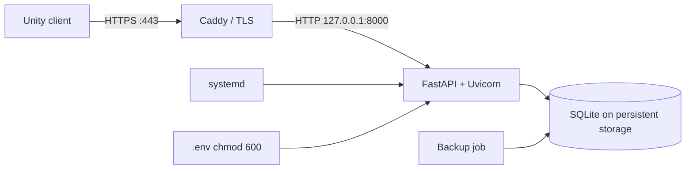

# VPS deployment

[Polska wersja](../pl/deployment.md)

This example uses Linux, systemd, and Caddy. Adjust the account, domain, paths, and
package commands for your distribution.

## Topology



Do not expose Uvicorn directly. Caddy terminates TLS and forwards requests to a
loopback-only process.

## System preparation

```bash
sudo apt update
sudo apt install python3.13 python3.13-venv sqlite3
sudo useradd --system --home /opt/otter-password-manager --shell /usr/sbin/nologin otter
sudo mkdir -p /opt/otter-password-manager
sudo chown otter:otter /opt/otter-password-manager
```

Python 3.13 availability depends on the distribution. A Python 3.13 Docker image is
an alternative.

## Application installation

Upload `backend` to `/opt/otter-password-manager/backend`, excluding the local
`.venv`, `.env`, and development database:

```bash
cd /opt/otter-password-manager/backend
sudo -u otter python3.13 -m venv .venv
sudo -u otter .venv/bin/python -m pip install .
sudo -u otter mkdir -p data
```

Create a production `.env` according to [configuration.md](configuration.md):

```bash
sudo chown otter:otter .env
sudo chmod 600 .env
sudo -u otter .venv/bin/alembic upgrade head
```

## systemd service

Create `/etc/systemd/system/otter-password-manager.service`:

```ini
[Unit]
Description=Otter Password Manager API
After=network.target

[Service]
Type=simple
User=otter
Group=otter
WorkingDirectory=/opt/otter-password-manager/backend
ExecStart=/opt/otter-password-manager/backend/.venv/bin/python -m otter_password_manager
Restart=on-failure
RestartSec=5
PrivateTmp=true
NoNewPrivileges=true

[Install]
WantedBy=multi-user.target
```

```bash
sudo systemctl daemon-reload
sudo systemctl enable --now otter-password-manager
sudo systemctl status otter-password-manager
```

## Reverse proxy and TLS

Example Caddyfile:

```caddyfile
api.example.com {
    reverse_proxy 127.0.0.1:8000
    encode zstd gzip
}
```

Caddy manages the certificate when DNS points to the VPS and ports 80/443 are
reachable. Configure Unity to use `https://api.example.com`.

## Firewall

Expose only ports 80/443 and secured SSH. Port 8000 must remain private because
Uvicorn listens on `127.0.0.1`.

## Updating

```bash
sudo systemctl stop otter-password-manager
# back up the database and key, then deploy new code
cd /opt/otter-password-manager/backend
sudo -u otter .venv/bin/python -m pip install .
sudo -u otter .venv/bin/alembic upgrade head
sudo systemctl start otter-password-manager
```

Verify `/docs`, login, and a sample entry. A dedicated health endpoint should be
added before production monitoring is introduced.

## Logs and diagnostics

```bash
sudo journalctl -u otter-password-manager -f
sudo systemctl status otter-password-manager
curl -v http://127.0.0.1:8000/docs
curl -v https://api.example.com/docs
```

- Local curl works but HTTPS fails: inspect proxy, DNS, certificate, and firewall.
- Neither works: inspect the service, `.env`, migrations, and port.
- `502 Bad Gateway`: the proxy cannot connect to Uvicorn.
- `401`: the access token is missing, invalid, expired, or a refresh token was used.
- `422`: the payload does not satisfy the schema.
- `500` while reading an entry: verify the AES key and server logs.
- `database is locked`: reduce concurrent processes or migrate to PostgreSQL.
- Unity works locally but not with VPS: use the HTTPS URL and verify DNS.

## Backups and monitoring

- automate daily SQLite backups,
- keep off-server copies,
- test recovery,
- monitor disk space, systemd status, and HTTPS responses,
- configure log retention,
- update the operating system and dependencies,
- keep the AES key backup in a separate secure location.

## Docker

Docker is optional. It can provide the same Python 3.13 environment locally and on
the VPS. `data` must be a persistent volume, and secrets must be injected at
runtime rather than baked into the image.

