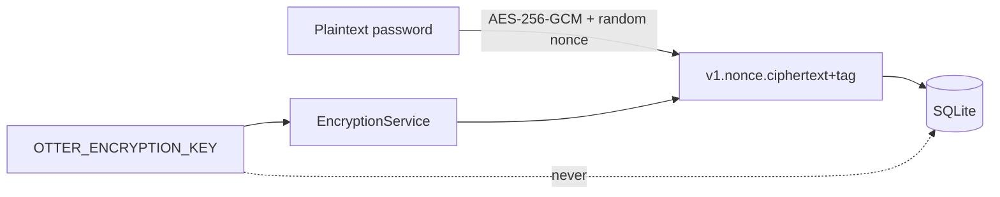

# Security

[Polska wersja](../pl/security.md)

## Protection model

| Purpose | Mechanism |
|---|---|
| account password | salted Argon2 hash |
| session and identity | HS256-signed JWTs |
| passwords stored in the vault | reversible AES-256-GCM encryption |

Account passwords cannot be recovered from the database. Vault passwords must be
recoverable, so they use an application encryption key.

## Argon2

`Argon2PasswordHasher` hashes passwords during registration and verifies them at
login. SQLite stores the encoded Argon2 hash, parameters, and salt. The API never
returns `hashed_password`. Account passwords require at least 12 characters.

## JWT

Access and refresh tokens contain:

- `sub` — user ID,
- `login`,
- `type` — `access` or `refresh`,
- `iat` and `exp`,
- `jti` — unique token ID.

Middleware accepts only `type=access` on protected endpoints and validates the
signature and expiration. Access tokens last 15 minutes by default; refresh tokens
last 30 days.

Current limitations:

- no refresh endpoint,
- no refresh rotation or revocation,
- no revoked-token list,
- Unity stores the refresh token only in RAM.

Unity logout removes local tokens but does not revoke an already issued access
token; that token remains valid until `exp`.

## AES-256-GCM

`EncryptionService` uses `cryptography.hazmat.primitives.ciphers.aead.AESGCM` and a
fresh 12-byte nonce for every operation. GCM provides confidentiality and an
authentication tag, so modified data cannot be decrypted.

Stored format:

```text
v1.<URL-safe Base64 nonce>.<URL-safe Base64 ciphertext and tag>
```

Constant associated data identifies the format, while `v1` allows future format
or algorithm migrations.



## Encryption key management

Generate exactly 32 random bytes encoded as URL-safe Base64:

```bash
python3.13 -c "import base64,secrets; print(base64.urlsafe_b64encode(secrets.token_bytes(32)).decode())"
```

Rules:

- use different keys for development, tests, and production,
- never commit the production `.env`,
- assign the correct VPS owner and `chmod 600`,
- keep an off-server backup,
- never put the key in SQLite, logs, a Unity build, or documentation,
- do not replace the key without re-encrypting all records.

Losing the key means losing every stored vault password. Replacing it without a
migration causes authentication-tag failures during decryption.

## JWT secret

Generate a separate random JWT secret:

```bash
python3.13 -c "import secrets; print(secrets.token_urlsafe(48))"
```

Changing it invalidates existing tokens but does not affect encrypted entries. The
JWT secret and AES key must never be the same value.

## Transport security

Plain HTTP is acceptable only on local `127.0.0.1`. Production must use HTTPS via
Caddy or Nginx. Without TLS, login and vault plaintext can be intercepted even
though the database itself is encrypted.

## Ownership authorization

`/passwords` never accepts `owner_id`. Middleware extracts identity from JWT and
the repository filters by both `entry_id` and `owner_id`. A foreign entry returns
`404`, not `403`.

This does not apply to technical `/api/v1/users` endpoints. They require a token
but do not enforce ownership or roles. This is a known production blocker.

## Production checklist

- [ ] HTTPS with automatic certificate renewal.
- [ ] fresh production-only secrets.
- [ ] `.env` outside Git with mode `600`.
- [ ] database backup and separate AES-key backup.
- [ ] debug and reload disabled.
- [ ] firewall exposing only 80/443 and restricted SSH.
- [ ] disable `/api/v1/users` or add an administrator role.
- [ ] rate limiting for login and registration.
- [ ] request-size limits and safe logging.
- [ ] refresh rotation and revocation.
- [ ] tested backup recovery procedure.
- [ ] operating system and dependency updates.

