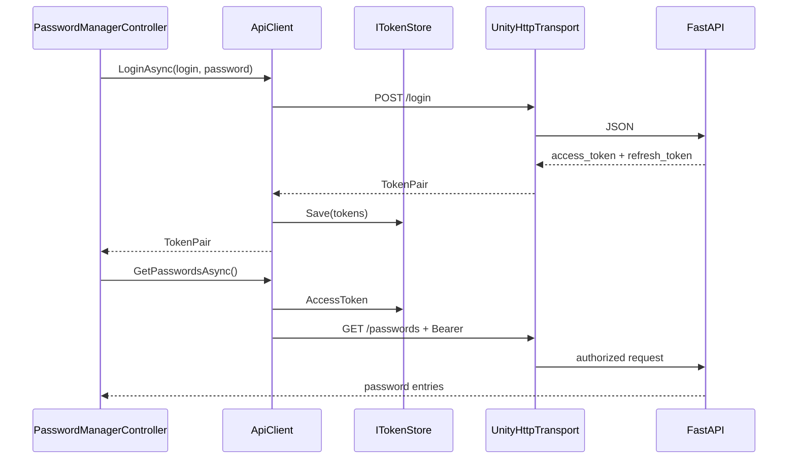

# Unity client

[Polska wersja](../pl/unity-client.md)

## Requirements and project status

The project currently uses Unity `2021.3.32f1`. Client code lives under:

```text
Assets/OtterPasswordManager/Runtime/
├── Application/        # IApiClient and models
├── Infrastructure/     # REST, JSON, and token storage
├── Presentation/       # UI and controller
└── Composition/        # bootstrapper
```

`com.unity.nuget.newtonsoft-json` handles JSON, including top-level arrays returned
by `GET /passwords`.

## Local startup

1. Start the backend at `http://127.0.0.1:8000`.
2. Open the Unity project and wait for compilation.
3. Open `Assets/Scenes/SampleScene.unity`.
4. Press **Play**.

`ApplicationBootstrapper` runs after scene loading, creates the client, and adds
`PasswordManagerController`. No prefab setup is required.

## Screens

- login,
- registration with automatic login,
- password list,
- create and edit forms,
- deletion,
- logout.

## Communication flow



`UnityHttpTransport` wraps `UnityWebRequest` with `Task` and `CancellationToken`.
The UI does not depend on HTTP details or Newtonsoft JSON.

## Changing the server address

The local URL is defined in `ApplicationBootstrapper.cs`:

```csharp
private const string LocalApiUrl = "http://127.0.0.1:8000";
```

Use an HTTPS address for production, such as `https://api.example.com`. A future
improvement should move this value into an environment-specific `ScriptableObject`.

## Tokens

`InMemoryTokenStore` keeps tokens only in RAM. Logout or application shutdown
removes them. Do not persist refresh tokens in `PlayerPrefs`; production builds
should use Keychain, Android Keystore, or Windows Credential Manager.

## Common issues

- “Cannot connect to server”: the backend is stopped or the URL is wrong.
- `401`: the access token is absent, invalid, or expired; log in again.
- Newtonsoft compilation errors: wait for package restoration and refresh assets.
- HTTP works in the Editor but not on mobile: use HTTPS and verify platform policy.
- Empty scene: exit Play Mode, wait for compilation, and start the scene again.

