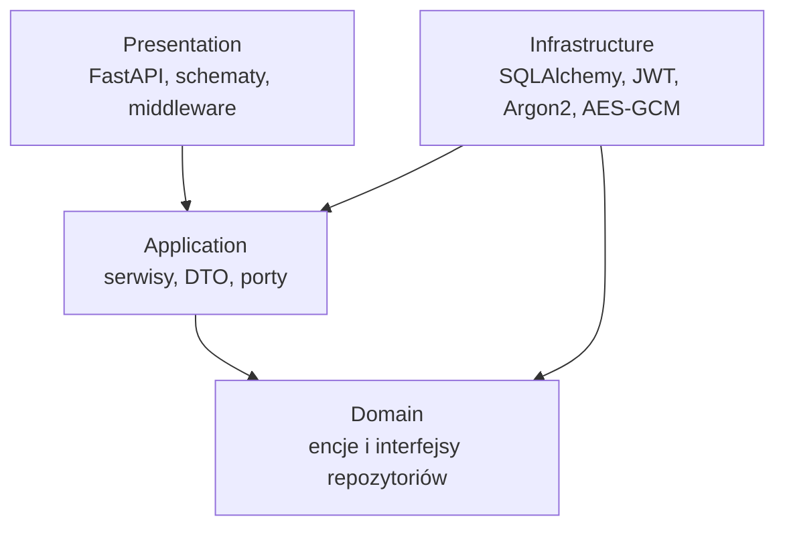
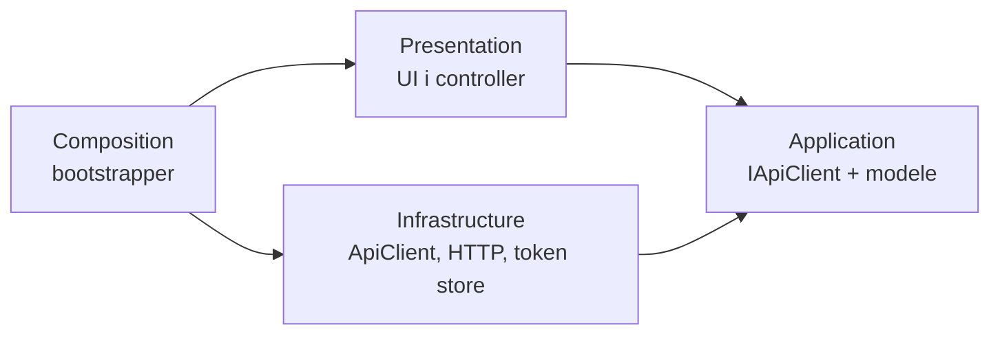
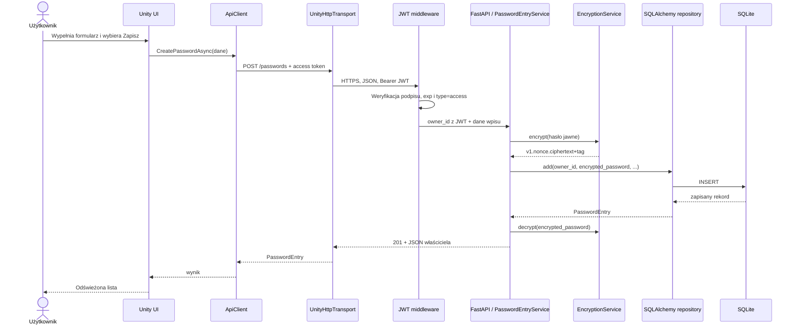

# Architektura rozwiązania

[English version](../en/architecture.md)

## Widok systemowy

```mermaid
flowchart LR
    U[Użytkownik] --> UI[Unity UI<br/>PasswordManagerController]
    UI --> AC[IApiClient / ApiClient]
    AC --> HT[UnityHttpTransport]
    HT -->|HTTPS + JSON + Bearer JWT| RP[Reverse proxy<br/>Caddy lub Nginx]
    RP --> API[FastAPI / Uvicorn]
    API --> MW[JWT middleware]
    MW --> UC[Serwisy aplikacyjne]
    UC --> ENC[EncryptionService<br/>AES-256-GCM]
    UC --> REP[Repozytoria SQLAlchemy]
    REP --> DB[(SQLite)]
    API --> JWT[JwtTokenService]
    API --> ARGON[Argon2PasswordHasher]
    ENC -. klucz z .env .-> ENV[Sekrety VPS]
    JWT -. sekret z .env .-> ENV
```

Unity i backend są osobnymi procesami. Unity nigdy nie odwołuje się bezpośrednio
do SQLite ani kodu Pythona. Jedyną granicą komunikacji jest REST API.

## Backend — Clean Architecture



Zasada zależności: kod wewnętrzny nie zna frameworków zewnętrznych.

### Domain

- `User` — użytkownik sejfu.
- `PasswordEntry` — wpis zawierający zaszyfrowane hasło.
- `UserRepository`, `PasswordEntryRepository` — kontrakty trwałości danych.

### Application

- `UserService` — CRUD użytkowników i reguły rejestracji.
- `AuthenticationService` — weryfikacja danych logowania i wydawanie tokenów.
- `PasswordEntryService` — CRUD sejfu, kontrola właściciela i użycie szyfrowania.
- porty `UnitOfWork`, `PasswordHasher`, `TokenService`, `EncryptionPort`.
- DTO niezależne od FastAPI i SQLAlchemy.

### Infrastructure

- modele i repozytoria SQLAlchemy,
- `SqlAlchemyUnitOfWork`,
- `Argon2PasswordHasher`,
- `JwtTokenService`,
- `EncryptionService`,
- konfiguracja, sesje bazy i logowanie.

### Presentation

- routery FastAPI,
- schematy Pydantic,
- middleware JWT,
- dependency injection i mapowanie wyjątków na odpowiedzi HTTP.

### Composition root

`ApplicationContainer` tworzy silnik bazy, fabrykę sesji, implementacje portów i
serwisy. `main.py` składa aplikację FastAPI i zarządza czasem życia zasobów.

## Unity — podział odpowiedzialności



- `PasswordManagerController` buduje widoki i obsługuje zdarzenia użytkownika.
- `IApiClient` jest kontraktem używanym przez UI.
- `ApiClient` mapuje operacje aplikacji na endpointy.
- `UnityHttpTransport` odpowiada wyłącznie za HTTP i JSON.
- `ITokenStore` oddziela sposób przechowywania tokenów.
- `ApplicationBootstrapper` tworzy i łączy obiekty po załadowaniu sceny.

## Scenariusz: zapis hasła



Hasło jawne istnieje chwilowo w pamięci klienta, w żądaniu HTTPS i w pamięci
backendu. W SQLite zapisywana jest wyłącznie koperta AES-GCM.
