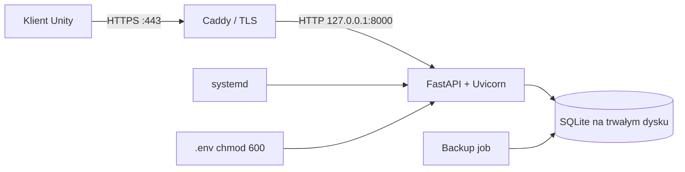

# Wdrożenie na VPS

[English version](../en/deployment.md)

Poniżej znajduje się przykładowy wariant dla Linuxa, systemd i Caddy. Nazwy konta,
domeny i ścieżek dostosuj do swojego serwera.

## Topologia



Uvicorn nie powinien być wystawiony bezpośrednio do internetu. Caddy kończy TLS i
przekazuje ruch do procesu dostępnego tylko na loopbacku.

## Przygotowanie systemu

```bash
sudo apt update
sudo apt install python3.13 python3.13-venv sqlite3
sudo useradd --system --home /opt/otter-password-manager --shell /usr/sbin/nologin otter
sudo mkdir -p /opt/otter-password-manager
sudo chown otter:otter /opt/otter-password-manager
```

Dostępność Pythona 3.13 zależy od dystrybucji; alternatywą jest obraz Docker z
Pythonem 3.13.

## Instalacja aplikacji

Wgraj katalog `backend` do `/opt/otter-password-manager/backend`, bez lokalnej
`.venv`, `.env` i deweloperskiej bazy. Następnie:

```bash
cd /opt/otter-password-manager/backend
sudo -u otter python3.13 -m venv .venv
sudo -u otter .venv/bin/python -m pip install .
sudo -u otter mkdir -p data
```

Utwórz produkcyjny `.env` według [configuration.md](configuration.md):

```bash
sudo chown otter:otter .env
sudo chmod 600 .env
sudo -u otter .venv/bin/alembic upgrade head
```

## Usługa systemd

`/etc/systemd/system/otter-password-manager.service`:

```ini
[Unit]
Description=Otter Password Manager API
After=network.target

[Service]
Type=simple
User=otter
Group=otter
WorkingDirectory=/opt/otter-password-manager/backend
ExecStart=/opt/otter-password-manager/backend/.venv/bin/python -m otter_password_manager
Restart=on-failure
RestartSec=5
PrivateTmp=true
NoNewPrivileges=true

[Install]
WantedBy=multi-user.target
```

```bash
sudo systemctl daemon-reload
sudo systemctl enable --now otter-password-manager
sudo systemctl status otter-password-manager
```

## Reverse proxy i TLS

Przykładowy Caddyfile:

```caddyfile
api.example.com {
    reverse_proxy 127.0.0.1:8000
    encode zstd gzip
}
```

Caddy automatycznie obsługuje certyfikat, jeśli domena wskazuje VPS i porty 80/443
są dostępne. Po konfiguracji ustaw w Unity `https://api.example.com`.

## Firewall

Publicznie otwórz tylko:

- `80/tcp` i `443/tcp`,
- SSH, najlepiej ograniczony adresami lub kluczami.

Port `8000` powinien pozostać zamknięty, ponieważ Uvicorn nasłuchuje na
`127.0.0.1`.

## Aktualizacja

```bash
sudo systemctl stop otter-password-manager
# wykonaj backup bazy i klucza
# wgraj nowy kod
cd /opt/otter-password-manager/backend
sudo -u otter .venv/bin/python -m pip install .
sudo -u otter .venv/bin/alembic upgrade head
sudo systemctl start otter-password-manager
```

Sprawdź `/docs`, logowanie i przykładowy wpis. W przyszłości warto dodać osobny
endpoint health check, aby monitoring nie polegał na dokumentacji OpenAPI.

## Logi i diagnostyka

```bash
sudo journalctl -u otter-password-manager -f
sudo systemctl status otter-password-manager
curl -v http://127.0.0.1:8000/docs
curl -v https://api.example.com/docs
```

Interpretacja:

- lokalny curl działa, HTTPS nie — problem proxy, DNS, certyfikatu lub firewalla;
- oba nie działają — sprawdź usługę, `.env`, migracje i port;
- `502 Bad Gateway` — proxy nie może połączyć się z Uvicornem;
- `401` — access token jest błędny/wygasły albo użyto refresh tokenu;
- `422` — payload nie spełnia schematu; sprawdź body w Swaggerze;
- `500` przy odczycie wpisu — sprawdź zgodność klucza AES i logi;
- `database is locked` — zbyt wiele równoczesnych zapisów/procesów; użyj jednego
  workera albo przejdź na PostgreSQL;
- Unity łączy się lokalnie, lecz nie z VPS — zmień URL na HTTPS i sprawdź DNS.

## Backup i monitoring

- automatyzuj codzienny backup SQLite,
- przechowuj kopie poza VPS,
- testuj odtwarzanie,
- monitoruj miejsce na dysku, status systemd i odpowiedzi HTTPS,
- ustaw rotację/retencję logów,
- aktualizuj system oraz zależności,
- przechowuj klucz AES w oddzielnym, bezpiecznym miejscu.

## Docker

Docker nie jest wymagany. Może później zapewnić identyczny Python 3.13 lokalnie i
na VPS. Katalog `data` musi wtedy być trwałym wolumenem, a sekrety powinny być
przekazywane jako bezpieczne zmienne/sekrety, nie zapisane w obrazie.
