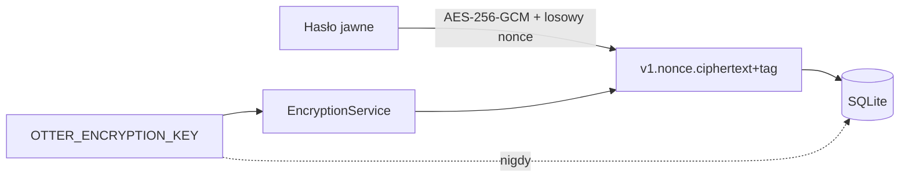

# Bezpieczeństwo

## Model ochrony

System rozdziela trzy mechanizmy:

| Cel | Mechanizm |
|---|---|
| hasło logowania użytkownika | hash Argon2 z losową solą |
| sesja i tożsamość | podpisane tokeny JWT HS256 |
| hasła zapisane w sejfie | odwracalne szyfrowanie AES-256-GCM |

Hasła logowania nie można odzyskać z bazy. Hasła sejfu muszą dać się odszyfrować,
dlatego korzystają z klucza aplikacyjnego.

## Argon2

`Argon2PasswordHasher` hashuje hasło podczas rejestracji i weryfikuje je podczas
logowania. Baza przechowuje kompletny zakodowany hash Argon2 wraz z parametrami i
solą. API nigdy nie zwraca `hashed_password`.

Minimalna długość hasła konta wynosi 12 znaków. To minimalna walidacja, a nie
gwarancja siły; warto później dodać ocenę haseł skompromitowanych i rate limiting.

## JWT

Access i refresh token zawierają m.in.:

- `sub` — identyfikator użytkownika,
- `login`,
- `type` — `access` albo `refresh`,
- `iat`, `exp`,
- `jti` — unikalny identyfikator tokenu.

Middleware akceptuje w chronionych endpointach tylko `type=access`. Sprawdza podpis
i datę ważności. Domyślny access token żyje 15 minut, refresh token 30 dni.

Obecne ograniczenia:

- brak endpointu wymiany refresh tokenu,
- brak rotacji i unieważniania refresh tokenów,
- brak listy wylogowanych/revoked tokenów,
- refresh token klienta istnieje tylko w RAM.

Wylogowanie Unity usuwa tokeny lokalnie, ale nie unieważnia już wydanego access
tokenu; wygaśnie on zgodnie z `exp`.

## AES-256-GCM

`EncryptionService` korzysta z `cryptography.hazmat.primitives.ciphers.aead.AESGCM`.
Dla każdego szyfrowania generuje nowy 12-bajtowy nonce. GCM zapewnia poufność oraz
tag integralności: zmieniona wartość nie zostanie odszyfrowana.

Format pola:

```text
v1.<nonce URL-safe Base64>.<ciphertext i tag URL-safe Base64>
```

Jako associated data używany jest stały identyfikator formatu. Prefiks `v1`
umożliwia przyszłą migrację algorytmu lub formatu.



## Zarządzanie kluczem szyfrowania

Klucz musi zawierać dokładnie 32 losowe bajty zakodowane URL-safe Base64:

```bash
python3.13 -c "import base64,secrets; print(base64.urlsafe_b64encode(secrets.token_bytes(32)).decode())"
```

Zasady:

- generuj osobny klucz dla developmentu, testów i produkcji,
- nie commituj produkcyjnego `.env`,
- na VPS ustaw właściciela pliku i `chmod 600`,
- przechowuj kopię klucza poza VPS,
- nie zapisuj klucza w SQLite, logach, buildzie Unity ani dokumentacji,
- nie zmieniaj klucza bez procedury re-encryption wszystkich rekordów.

Utrata klucza oznacza utratę wszystkich zapisanych haseł. Zastąpienie klucza nowym
bez migracji spowoduje błędy integralności przy odszyfrowywaniu.

## Sekret JWT

Sekret JWT również powinien być losowy i mieć co najmniej 32 bajty entropii:

```bash
python3.13 -c "import secrets; print(secrets.token_urlsafe(48))"
```

Zmiana sekretu JWT unieważnia wszystkie dotychczasowe tokeny, ale nie wpływa na
zaszyfrowane wpisy. Sekret JWT i klucz AES muszą być różnymi wartościami.

## Transport

Lokalny HTTP jest dopuszczalny wyłącznie na `127.0.0.1`. Na VPS używaj HTTPS przez
Caddy/Nginx. Bez TLS hasła jawne wysyłane do `/login` i pola `passwords` mogą zostać
przechwycone mimo szyfrowania bazy.

## Autoryzacja właściciela

Endpointy `/passwords` nie przyjmują `owner_id`. Middleware odczytuje użytkownika z
JWT, a repozytorium filtruje jednocześnie po `entry_id` i `owner_id`. Cudzy wpis
zwraca `404`, a nie `403`.

Nie dotyczy to technicznych `/api/v1/users`: wymagają tokenu, ale obecnie nie
sprawdzają właściciela ani roli. To znane ryzyko do usunięcia przed produkcją.

## Lista kontrolna przed produkcją

- [ ] HTTPS i automatyczne odnawianie certyfikatu.
- [ ] nowe, losowe sekrety produkcyjne.
- [ ] `.env` poza repozytorium, uprawnienia `600`.
- [ ] backup bazy i osobny backup klucza AES.
- [ ] wyłączenie `debug` i `reload`.
- [ ] firewall: publiczne tylko 80/443 i ograniczony SSH.
- [ ] usunięcie lub ochrona rolą endpointów `/api/v1/users`.
- [ ] rate limiting logowania i rejestracji.
- [ ] limit rozmiaru requestów i bezpieczne logowanie.
- [ ] mechanizm refresh/rotation/revocation.
- [ ] test odtwarzania backupu.
- [ ] aktualizacje systemu i zależności.

