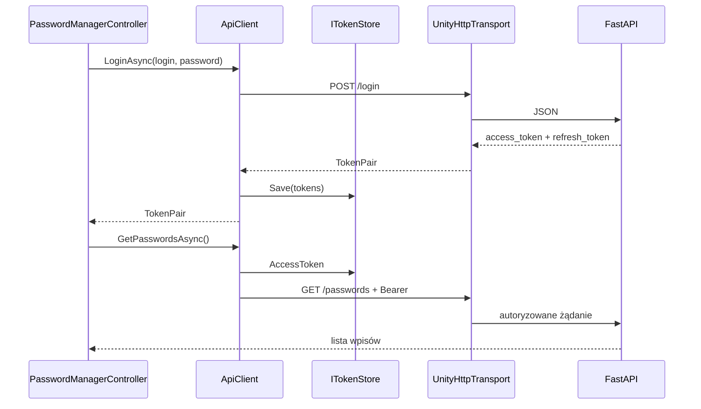

# Klient Unity

## Wymagania i stan projektu

Projekt został utworzony w Unity `2021.3.32f1`. Kod klienta znajduje się w:

```text
Assets/OtterPasswordManager/Runtime/
├── Application/        # IApiClient i modele
├── Infrastructure/     # REST, JSON i token store
├── Presentation/       # UI i controller
└── Composition/        # bootstrapper
```

Pakiet `com.unity.nuget.newtonsoft-json` obsługuje serializację JSON, w tym tablice
zwracane przez `GET /passwords`.

## Uruchamianie lokalne

1. Uruchom backend pod `http://127.0.0.1:8000`.
2. Otwórz projekt w Unity i zaczekaj na zakończenie kompilacji.
3. Otwórz scenę `Assets/Scenes/SampleScene.unity`.
4. Naciśnij **Play**.

`ApplicationBootstrapper` uruchamia się automatycznie po załadowaniu sceny, tworzy
klienta i dodaje `PasswordManagerController`. Nie trzeba ręcznie dodawać prefabów.

## Ekrany

- logowanie,
- rejestracja z automatycznym logowaniem,
- lista wpisów,
- dodawanie i edycja,
- usuwanie,
- wylogowanie.

## Komunikacja



`UnityHttpTransport` korzysta z `UnityWebRequest`, ale udostępnia `Task` i
`CancellationToken`. UI nie zna szczegółów HTTP ani Newtonsoft JSON.

## Zmiana adresu serwera

Lokalny adres znajduje się w `ApplicationBootstrapper.cs`:

```csharp
private const string LocalApiUrl = "http://127.0.0.1:8000";
```

W buildzie produkcyjnym ustaw adres HTTPS, np.:

```csharp
private const string LocalApiUrl = "https://api.example.com";
```

Docelowo warto przenieść adres do `ScriptableObject` lub konfiguracji zależnej od
środowiska, aby build deweloperski i produkcyjny nie wymagały edycji kodu.

## Tokeny

Obecny `InMemoryTokenStore` przechowuje tokeny tylko w RAM. Wylogowanie lub
zamknięcie aplikacji je usuwa. Nie używaj `PlayerPrefs` do trwałego zapisywania
refresh tokenu. Implementacja produkcyjna powinna używać magazynu systemowego,
np. Keychain, Android Keystore lub Windows Credential Manager.

## Typowe problemy

- komunikat „Nie można połączyć się z serwerem”: backend nie działa albo adres jest
  błędny;
- `401`: brak, wygaśnięcie lub niepoprawny access token — zaloguj się ponownie;
- błędy kompilacji Newtonsoft: zaczekaj na pobranie pakietów i wykonaj refresh;
- HTTP działa w Editorze, ale nie w buildzie mobilnym: użyj HTTPS i sprawdź politykę
  bezpieczeństwa platformy;
- aplikacja pokazuje pustą scenę: zatrzymaj Play Mode, zaczekaj na kompilację i
  uruchom scenę ponownie.

