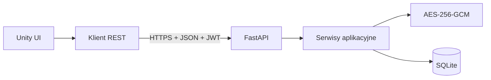

# Otter Password Manager

Menedżer haseł z klientem Unity i backendem FastAPI. Projekt zapewnia
uwierzytelnianie JWT, szyfrowany sejf, trwałość SQLite oraz prosty interfejs Unity.

[English version](README.md)

## Technologie

- klient Unity w C# z `UnityWebRequest` i async/await,
- Python 3.13 i FastAPI,
- SQLAlchemy 2 i SQLite,
- migracje Alembic,
- hashowanie haseł konta Argon2,
- access i refresh tokeny JWT,
- szyfrowanie sejfu AES-256-GCM.

## Architektura



## Szybki start

```powershell
cd backend
.\.venv\Scripts\alembic.exe upgrade head
.\.venv\Scripts\python.exe -m otter_password_manager
```

Otwórz `Assets/Scenes/SampleScene.unity` i naciśnij **Play**. Swagger UI znajduje
się pod `http://127.0.0.1:8000/docs`.

## Dokumentacja

- [Dokumentacja po polsku](docs/pl/README.md)
- [English documentation](docs/en/README.md)

## Stan bezpieczeństwa

Projekt jest aktywnie rozwijany. Przed publicznym wdrożeniem przeczytaj
[listę bezpieczeństwa](docs/pl/security.md), zabezpiecz lub usuń `/api/v1/users`,
dodaj rotację refresh tokenów i używaj wyłącznie HTTPS.

